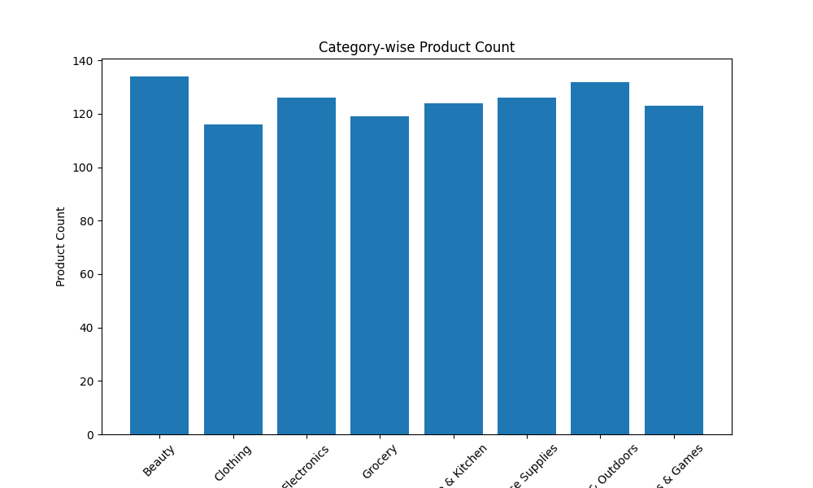
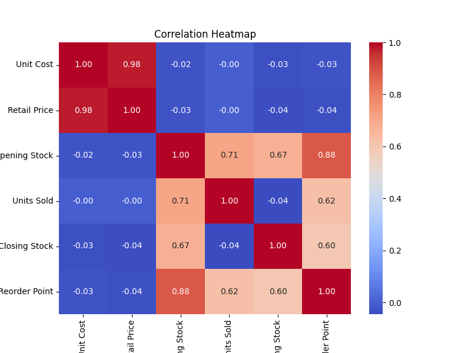
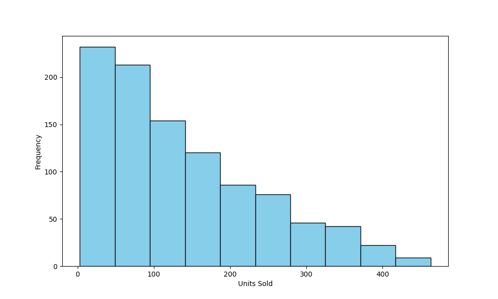
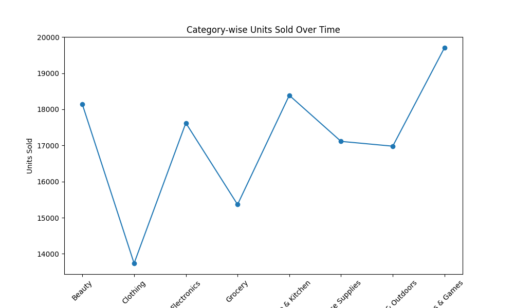
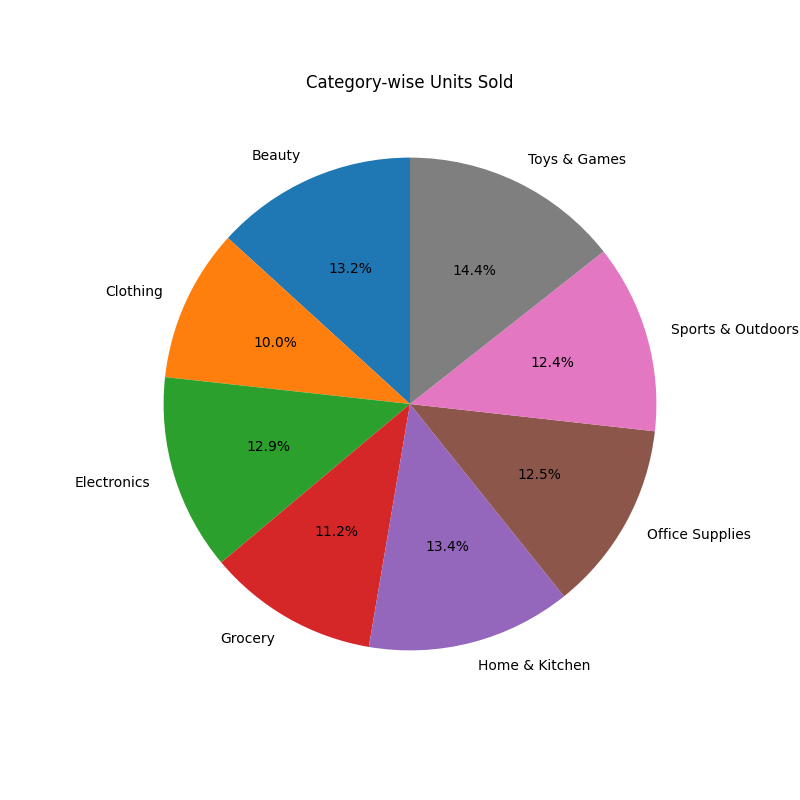

This project analyzes retail inventory data using Python and data visualization libraries.  
The analysis helps understand sales trends, stock levels, and product performance.

## Tools & Technologies
- Python
- Pandas
- Matplotlib
- Seaborn
- Google Colab

## Features
- Data Cleaning
- Sales Analysis
- Inventory Insights
- Data Visualization
- Correlation Analysis

## Visualizations

### Bar Chart

### Correlation Heatmap

### Histogram

### Line Graph

### Pie Chart

## Files Included
- Read_Excel_Colab.ipynb → Main notebook
- retail_inventory_report.md → Report
- Visualization PNG files

## Conclusion
This project demonstrates basic data analysis and visualization skills useful for retail business insights.

---
✨ Created by Vaishnavi Bongale
